# Responsive Web Design

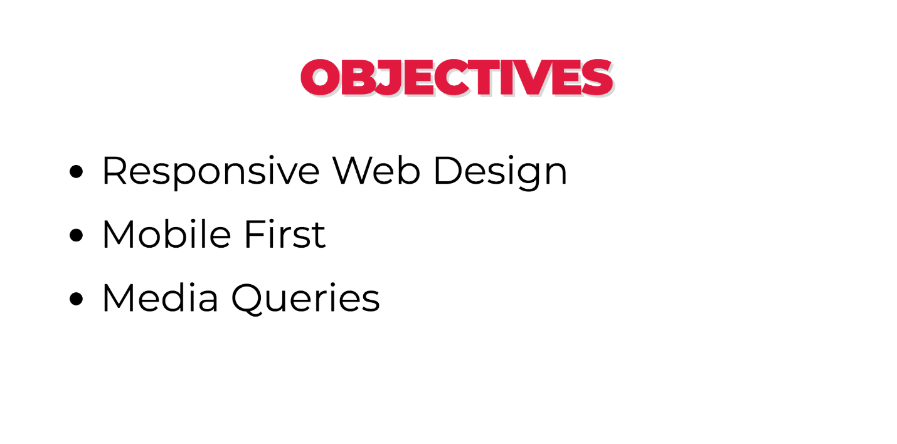

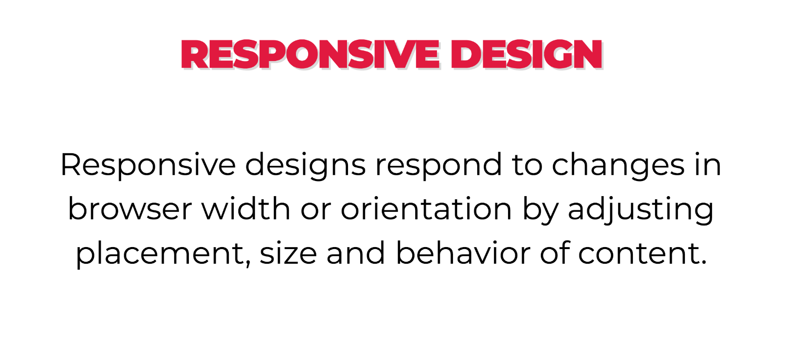

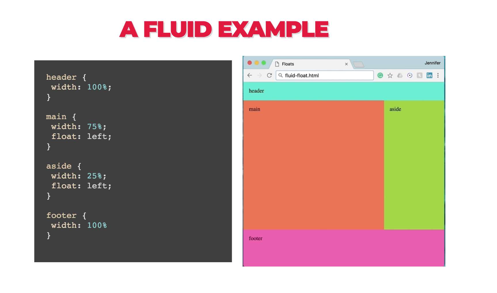

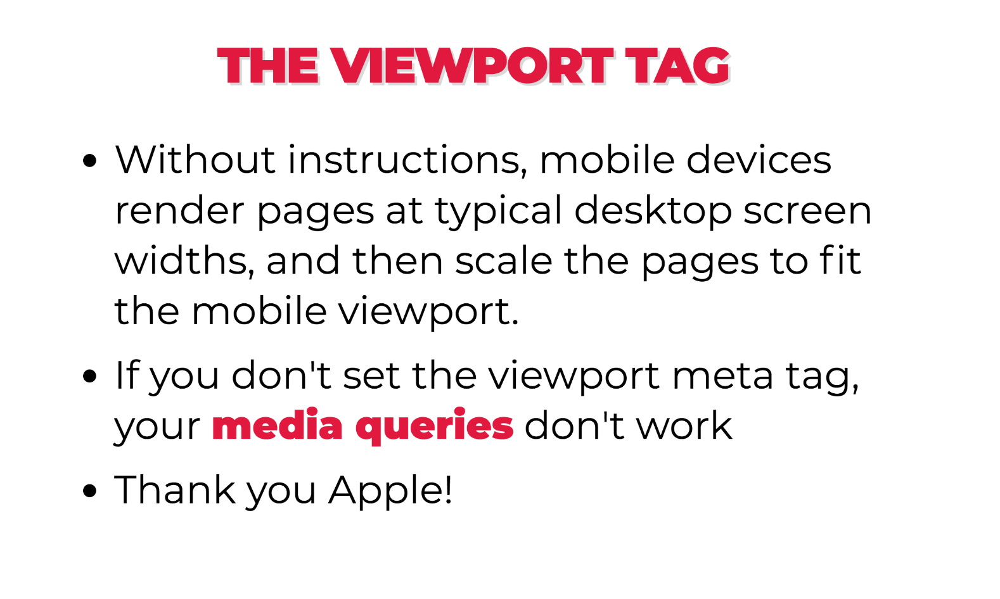

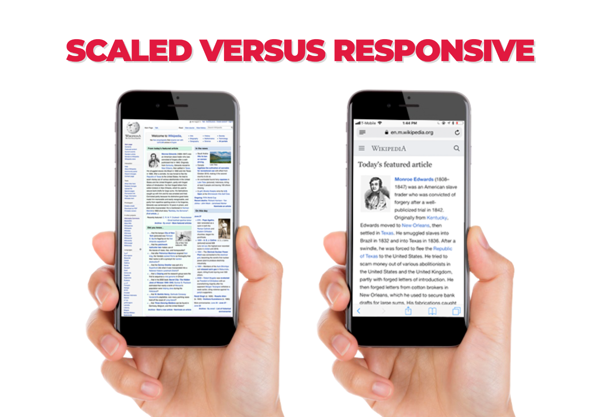

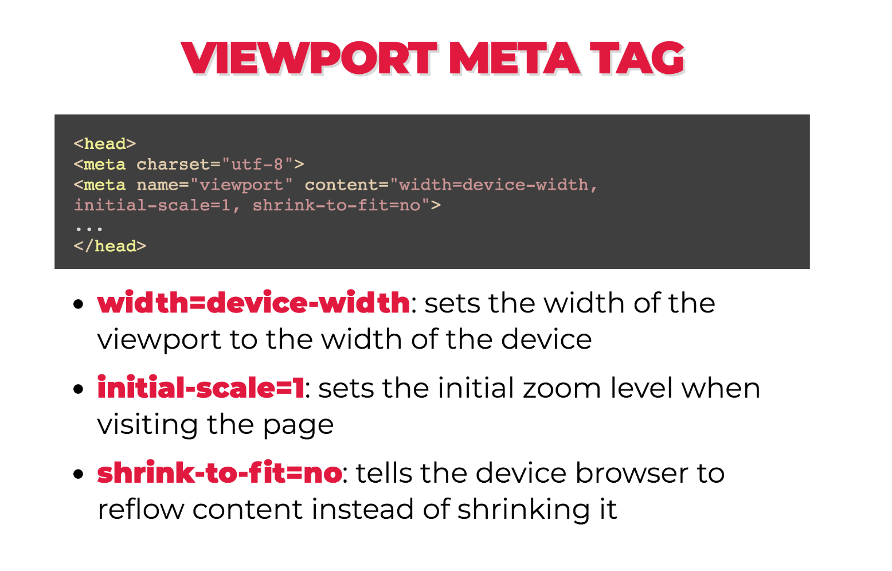

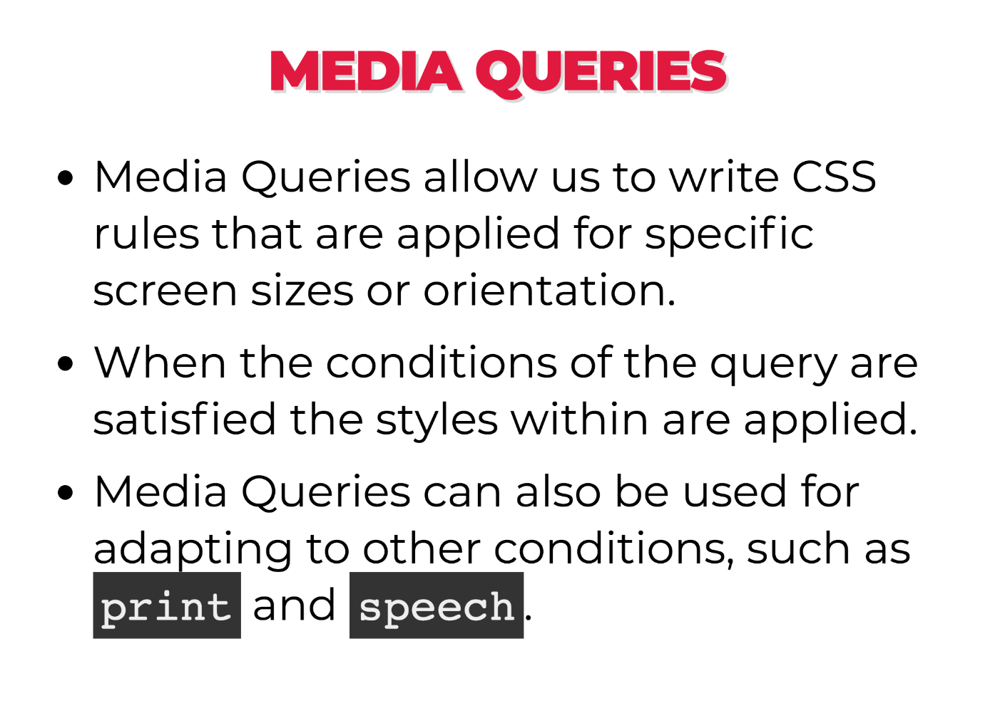

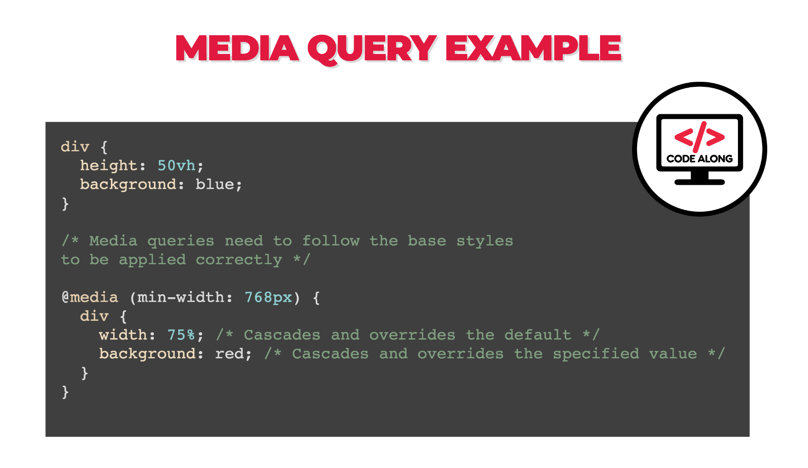

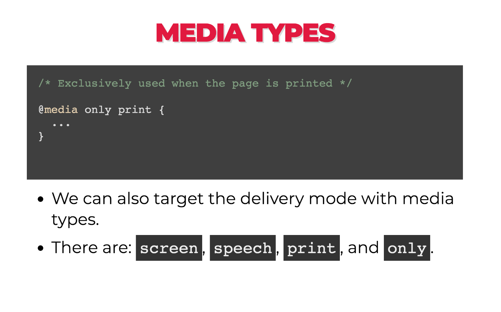

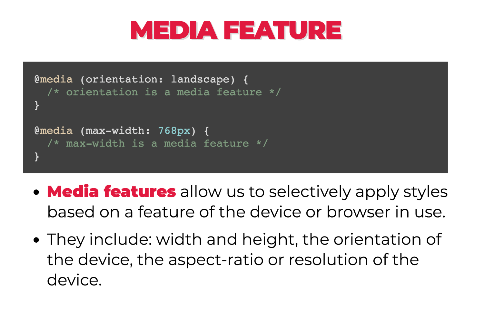

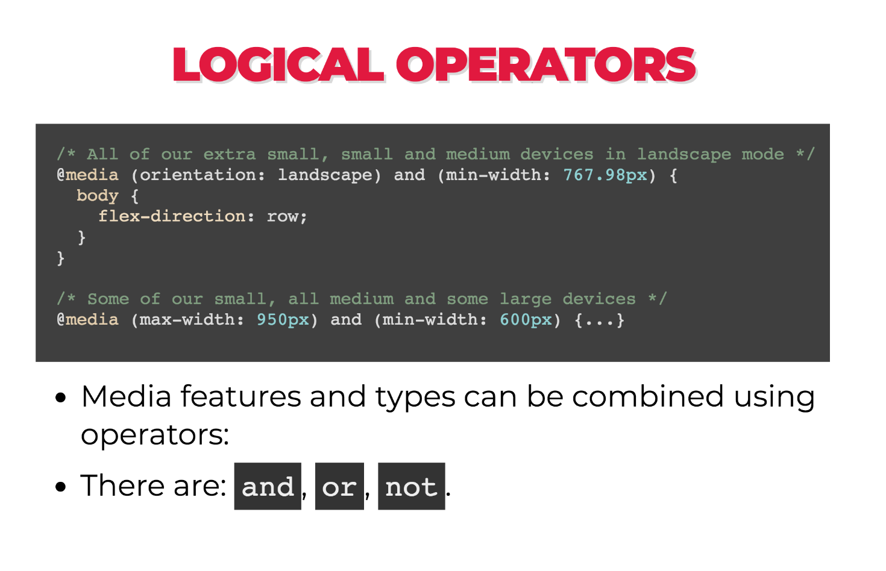

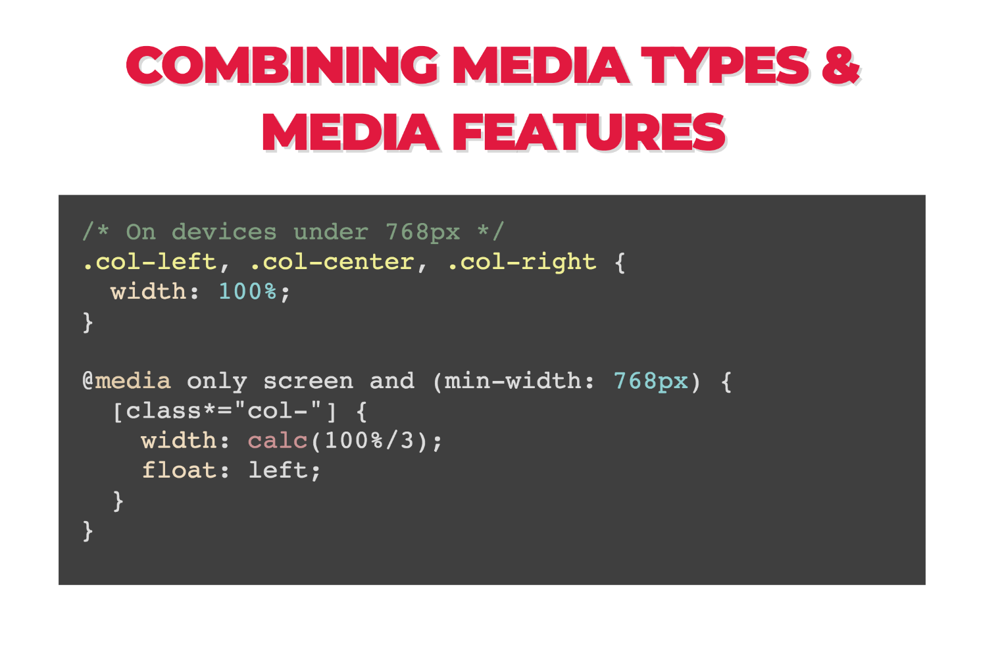

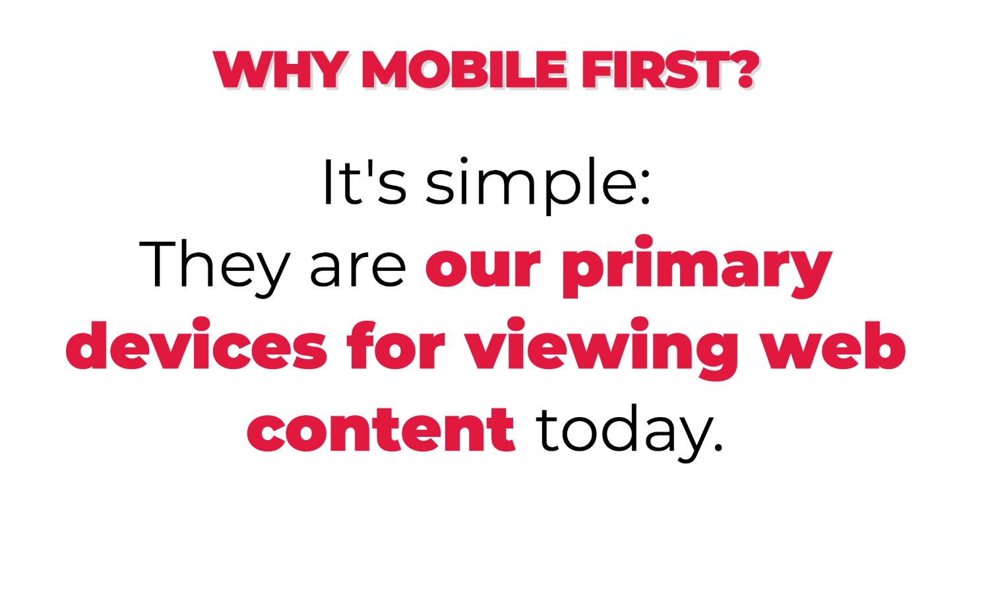

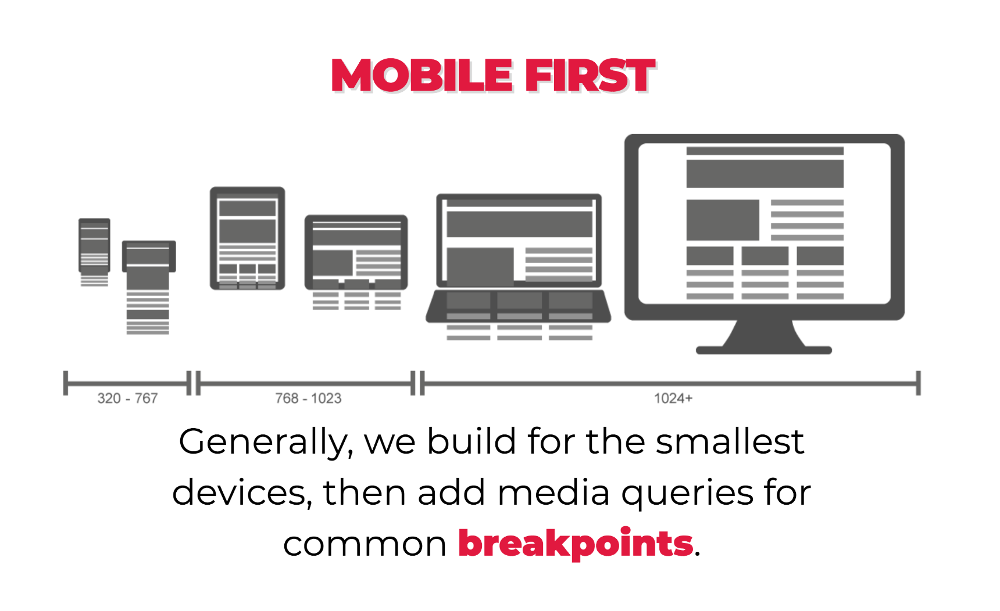

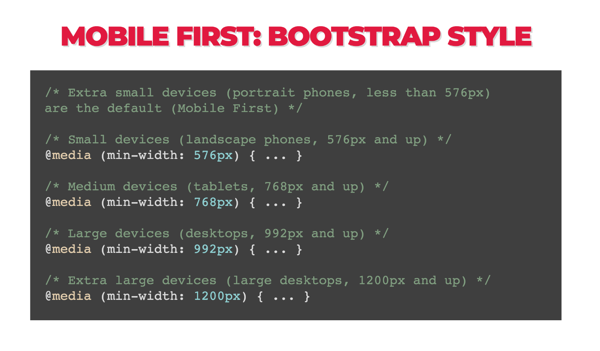

## What are the most common dimensions for a website design?

Why don't you tell me! http://screensiz.es

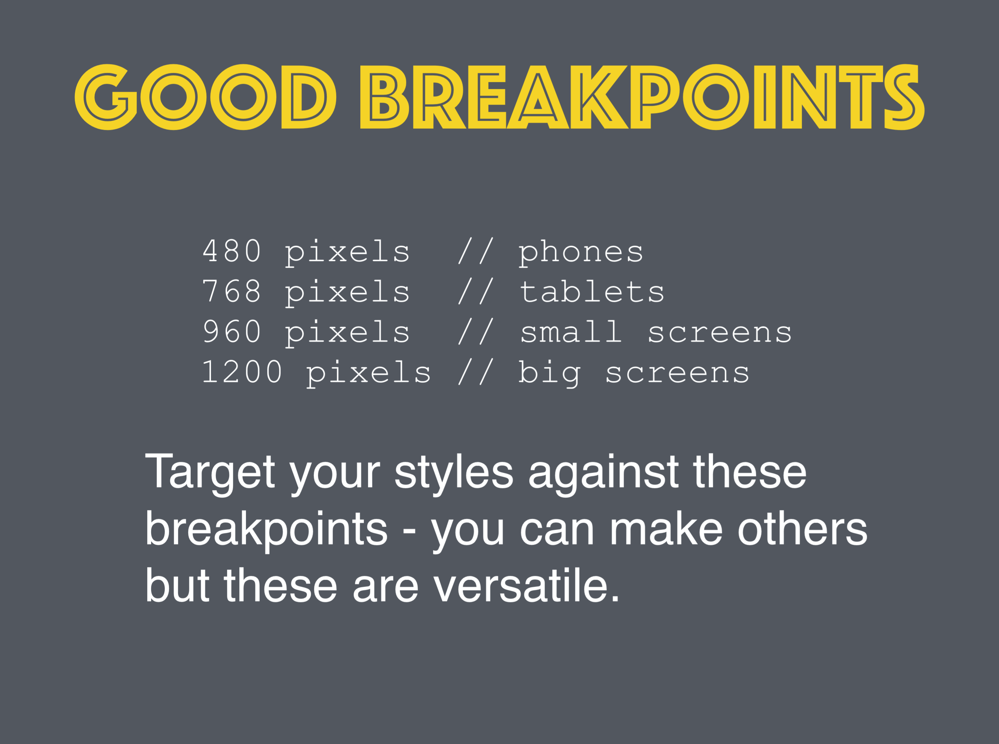

#### Examples of non-responsive sites:

It is becoming harder and harder to find non-responsive websites. But here is an example 
of a [non-responsive 
website](https://dequeuniversity.com/library/responsive/1-non-responsive) for you to try 
out.

#### Examples of mobile specific sites:
One way to create optimal experiences for mobile users is a dedicated mobile site.

You know you're on one when you see `m.` in the url!

Compare https://m.xkcd.com with https://xkcd.com


Avoid these... please.

#### Examples of responsive sites:

- [Boston Globe](http://www.bostonglobe.com/)  
- [GA](https://generalassemb.ly/)
- [Responsive Meme](http://responsivememe.webflow.io/)


What's the difference between these? Let's resize again.
Interestingly, **Boston Globe was the first example of a responsive website.**

Instead of manually resizing the page, which can be a pain, we can use Google Chrome 
DevTools.


**Chrome DevTools in Action:**

- Let's visit GA's homepage
- Click on the device icon next to the magnifying glass
- You can change the pixel width (displayed at the top) using the drag tool
- You can select any device using the dropdown menu at the top


## Make a responsive website - Codealong


#### Make the columns responsive

How do we go about splitting these columns across the page?

Where the CSS for the columns have been defined (at the bottom) let's add:

```css
main .column {
  float: left;
  width: 33.33%;
}
```

#### Adjusting the container width

If we try and resize the page - nothing. This is because the contain element has a fixed width. Let's change the css for the main selector:

```css
header, main {
  max-width: 960px;
  margin: 0 auto;
  position: relative;
}
```

Let's test!

It works, but the text gets squished. This will not look good when there is lots to read.

#### Setting a min-width

Let's set a min-width instead to prevent this:

```css
main .column {
  float: left;
  width: 33.33%;
  min-width: 320px;
}
```

When there is not enough space for the 320px element to fit, it will now flow underneath 
the element to it's left, starting from the right to the left.


We include this at the bottom of the page.

```css
@media only screen and (max-width: 960px) {  
  main .column {
    width: 50%;
  }
  main .column:last-child {
    width: 100%;
  }
}
```

Specificity still applies. So if we didn't add `main` then this still wouldn't be as specific as the one above.

#### Max-width 640px

This looks good when the window is greater than 640px, but we'll need to add one more media query for when the window is smaller than this.

```css
@media only screen and (max-width: 640px) {
  main .column {
    width: 100%;
  }
}
```

Let's test! Great!


#### Style the header

Our columns are now working but we need to do a little bit of work on our header.

Sometimes, with responsive design, we have to decide to omit content from a site. This can sometimes mean that we are loading content on the mobile device that the user can't see - that will slow their page down - however, for this example, we will not worry about that.

```css
@media only screen and (max-width: 960px) {
  header nav ul li {
    display: none;
  }
}
```

If we resize the page, everything in the header disappears. Let's just show the first li with the header and the last one with the menu:

```css
@media only screen and (max-width: 960px) {  
  header nav ul li {
    display: none;
  }

  header nav > ul > li:nth-child(1),
  header nav > ul > li:nth-child(4) {
    display: block;
  }
}
```

This is a _little_ better.

#### Title

Now we want the title to change size depending on the browser size. Let's do the middle size first:

```css
@media only screen and (max-width: 960px) {  
  header nav ul li {
    display: none;
  }

  header nav > ul > li:nth-child(1),
  header nav > ul > li:nth-child(4) {
    display: block;
  }

  header nav > ul > li:nth-child(1) {
    text-align: center;
    padding: 30px 0;
  }

  header nav > ul > li:nth-child(1) h1 {
    font-size: 40px;
  }
}
```

Now, let's do the smaller browser:

```css
@media only screen and (max-width: 640px) {
  header nav > ul > li:nth-child(1) {
    text-align: center;
    padding: 15px 0;
  }

  header nav > ul > li:nth-child(1) h1 {
    font-size: 30px;
  }
}
```

## Flexible Images

We need images that fit their containers.  By default, images will try to take up as much 
space as it's initial dimensions. This can cause some pain when you size up and size down 
your picture, especially if you are trying to control the size of your elements via a 
parent `div`.

It turns `max-width: 100%` is the answer. Most of the time. For any media.

Even as our flexible container resizes, shrinking or enlarging our image, the image’s 
aspect ratio remains intact.

```css
img,
embed,
object,
video {
  max-width: 100%;
  height: auto;
}
```

# The Ultimate James Bond Fan Site

Your client has an awesome James Bond website that they want to make responsive. However, they don't want to modify their existing HTML, so they've asked you to **only compose a new stylesheet**.

Notes:

- **DO NOT MODIFY THE HTML**
- Look up `max-width` (css).
- Look up `@media` (css).


